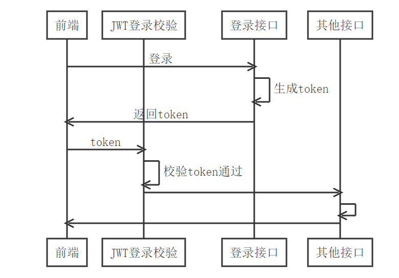
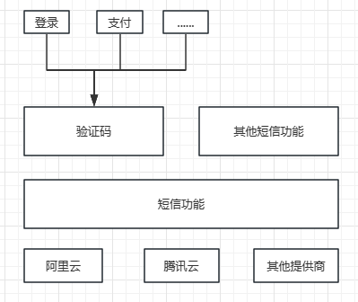
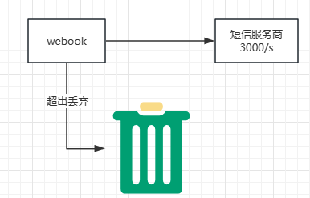
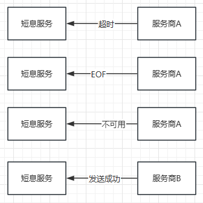

## 登录实现

登录本身分为两部分

- 实现登录功能 (/users/login接口)
- 登录态校验 (Cookie, Session, JWT)

### 登录态实现

过程：

- 在登录接口中，登录成功后生成 JWT token。
  - 在 JWT token 中写入数据。
  - 把 JWT token 通过 HTTP Response Header `x-jwt-token` 返回。
- HTTP请求时携带 JWT token。
- 登录校验 Gin middleware。
  - 读取 JWT token。
  - 验证 JWT token 是否合法。

### 验证码登录

除了登录功能，修改密码、危险操作二次验证等业务都需要用到验证码。

所以，手机验证码应该是一个独立的功能。

- 如果是模块，那么它是一个独立的模块。
- 如果是微服务，那么它是一个独立的微服务。

手机验证码要通过短信来发送， 那么短信也会被别的业务使用，另外可能换短信供应商，比如腾讯云和阿里云。

综合考虑，以下两点：

- 不同业务都要用短信功能和验证码功能
- 可能换供应商

## 短信设计

### 短信限流
短信服务商本身有调用频率限制，比如腾讯阈值是3000/s,与其等待服务商限流响应，不如直接本地就限制

### 短信服务出错
限流是为了不触发短信服务商的自我保护机制，如果服务商真的出问题了，需要切换新的服务商
